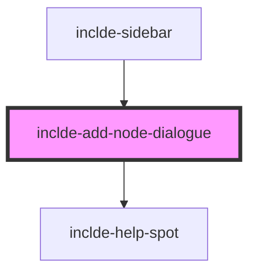

# inclde-add-node-dialogue

<!-- Auto Generated Below -->

## Overview

This class represents the dialogue that is shown when the user wants to add a new node.

It aims to replace the functionality of the inclde-view-edit component in the long term.
The functionality of the inclde-view-edit component is currently:

- (ATTRIBUTE) Add a new attribute (main purpose)
- (RELATION) relate it to the selected node
- (NODE) Add a new node to the data, if a unused ID is entered (but only with a relation to an existing node)
- (ARRAY_ELEMENT) Add a element to an array attribute of the selected node, if subElement property is set

The functionality of the inclde-add-node-dialogue component is currently:

- (NODE) Add a new node to the data (main purpose)
- (RELATION) Add a relation to an existing node, if such a node is given to the component (only supports https://schema.org/ relations)

## Properties

| Property            | Attribute          | Description                                                                                                                         | Type                  | Default     |
| ------------------- | ------------------ | ----------------------------------------------------------------------------------------------------------------------------------- | --------------------- | ----------- |
| `allowPrimitives`   | `allow-primitives` | Setting to determine if it is allowed to add primitives to the data.                                                                | `boolean`             | `false`     |
| `data` _(required)_ | --                 | The data to which the new node should be added.                                                                                     | `NodeObject[]`        | `undefined` |
| `relationTo`        | `relation-to`      | The node to which the new node should be connected to, if desired. Setting this property will add a relation field to the dialogue. | `string \| undefined` | `undefined` |

## Events

| Event       | Description                                     | Type                            |
| ----------- | ----------------------------------------------- | ------------------------------- |
| `nodeAdded` | Event that is fired when the new node is added. | `CustomEvent<CustomEvent<any>>` |

## Dependencies

### Used by

 - [inclde-sidebar](../inclde-sidebar)

### Depends on

- [inclde-help-spot](../inclde-help-spot)

### Graph

----------------------------------------------

*Built with [StencilJS](https://stenciljs.com/)*
