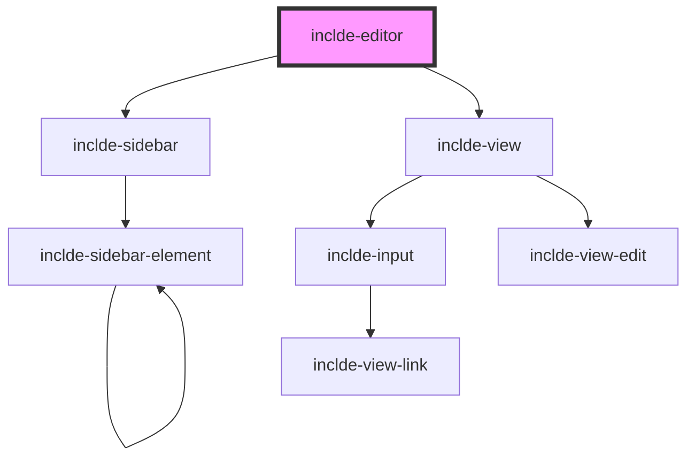

# inclde-editor

<!-- Auto Generated Below -->

## Properties

| Property              | Attribute | Description | Type               | Default     |
| --------------------- | --------- | ----------- | ------------------ | ----------- |
| `config` _(required)_ | `config`  |             | `object \| string` | `undefined` |
| `data` _(required)_   | `data`    |             | `object \| string` | `undefined` |

## Events

| Event          | Description                                                                                                                                                                  | Type                                                   |
| -------------- | ---------------------------------------------------------------------------------------------------------------------------------------------------------------------------- | ------------------------------------------------------ |
| `dataUpdated`  | Fired when the data is updated. Can be used to peek into the data from outside the editor. Not yet reliably fired. Returns the same information as the `editorClosed` event. | `CustomEvent<NodeObject \| NodeObject[] \| string>`    |
| `editorClosed` | Fired when the editor is closed with the save or cancel buttons. `event.detail` contains the edited data if the save button was clicked, undefined otherwise.                | `CustomEvent<NodeObject \| NodeObject[] \| undefined>` |

## Dependencies

### Depends on

- [inclde-sidebar](../inclde-sidebar)
- [inclde-view](../inclde-view)

### Graph

----------------------------------------------

*Built with [StencilJS](https://stenciljs.com/)*
