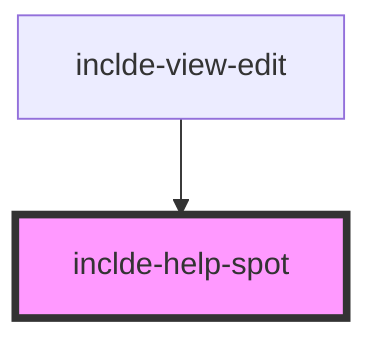

# inclde-help-spot

<!-- Auto Generated Below -->

## Properties

| Property   | Attribute   | Description | Type     | Default |
| ---------- | ----------- | ----------- | -------- | ------- |
| `helpText` | `help-text` |             | `string` | `''`    |

## Dependencies

### Used by

 - [inclde-view-edit](../inclde-view-edit)

### Graph

----------------------------------------------

*Built with [StencilJS](https://stenciljs.com/)*
