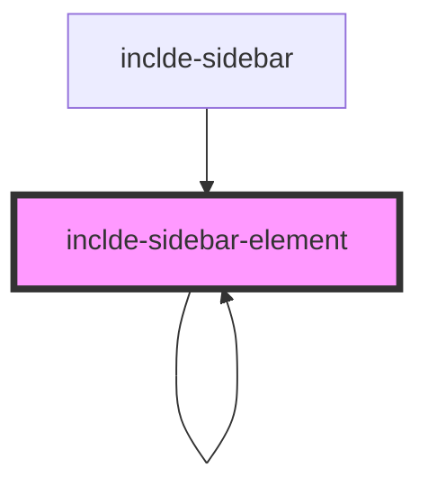

# inclde-sidebar-element

<!-- Auto Generated Below -->

## Properties

| Property            | Attribute         | Description | Type                  | Default     |
| ------------------- | ----------------- | ----------- | --------------------- | ----------- |
| `data` _(required)_ | --                |             | `NodeObject[]`        | `undefined` |
| `globalSelector`    | `global-selector` |             | `number \| undefined` | `undefined` |
| `selector`          | `selector`        |             | `number \| undefined` | `undefined` |

## Events

| Event             | Description | Type                                                                                   |
| ----------------- | ----------- | -------------------------------------------------------------------------------------- |
| `elementSelected` |             | `CustomEvent<{ selectIndex?: number \| undefined; selectUrl?: string \| undefined; }>` |

## Dependencies

### Used by

 - [inclde-sidebar](../inclde-sidebar)
 - [inclde-sidebar-element](.)

### Depends on

- [inclde-sidebar-element](.)

### Graph

----------------------------------------------

*Built with [StencilJS](https://stenciljs.com/)*
