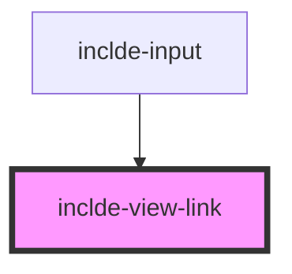

# inclde-view-link

<!-- Auto Generated Below -->

## Properties

| Property   | Attribute  | Description | Type                  | Default     |
| ---------- | ---------- | ----------- | --------------------- | ----------- |
| `data`     | --         |             | `NodeObject[]`        | `[]`        |
| `label`    | `label`    |             | `string`              | `'Unknown'` |
| `selector` | `selector` |             | `number \| undefined` | `undefined` |

## Events

| Event             | Description | Type                                                                                   |
| ----------------- | ----------- | -------------------------------------------------------------------------------------- |
| `elementSelected` |             | `CustomEvent<{ selectIndex?: number \| undefined; selectUrl?: string \| undefined; }>` |

## Dependencies

### Used by

 - [inclde-input](../inclde-input)

### Graph

----------------------------------------------

*Built with [StencilJS](https://stenciljs.com/)*
