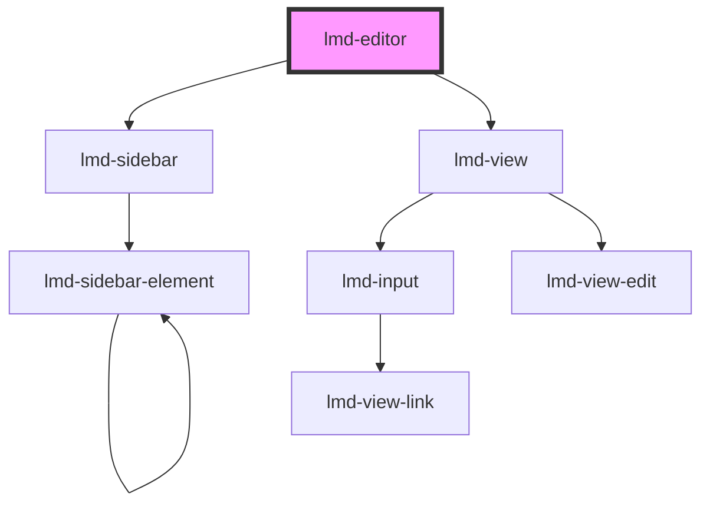

# lmd-editor

<!-- Auto Generated Below -->

## Properties

| Property              | Attribute | Description | Type               | Default     |
| --------------------- | --------- | ----------- | ------------------ | ----------- |
| `config` _(required)_ | `config`  |             | `object \| string` | `undefined` |
| `data` _(required)_   | `data`    |             | `object \| string` | `undefined` |

## Events

| Event          | Description | Type                                   |
| -------------- | ----------- | -------------------------------------- |
| `dataUpdated`  |             | `CustomEvent<object \| string>`        |
| `editorClosed` |             | `CustomEvent<NodeObject \| undefined>` |

## Dependencies

### Depends on

- [lmd-sidebar](../lmd-sidebar)
- [lmd-view](../lmd-view)

### Graph

----------------------------------------------

*Built with [StencilJS](https://stenciljs.com/)*
