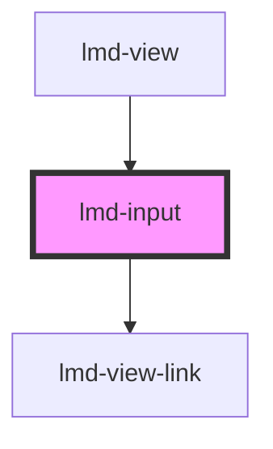

# lmd-input

<!-- Auto Generated Below -->

## Properties

| Property     | Attribute     | Description | Type                   | Default |
| ------------ | ------------- | ----------- | ---------------------- | ------- |
| `data`       | --            |             | `NodeObject[]`         | `[]`    |
| `isEditable` | `is-editable` |             | `boolean`              | `true`  |
| `selector`   | --            |             | `(string \| number)[]` | `[]`    |

## Events

| Event             | Description | Type                                                                                   |
| ----------------- | ----------- | -------------------------------------------------------------------------------------- |
| `elementSelected` |             | `CustomEvent<{ selectIndex?: number \| undefined; selectUrl?: string \| undefined; }>` |

## Dependencies

### Used by

 - [lmd-view](../lmd-view)

### Depends on

- [lmd-view-link](../lmd-view-link)

### Graph

----------------------------------------------

*Built with [StencilJS](https://stenciljs.com/)*
