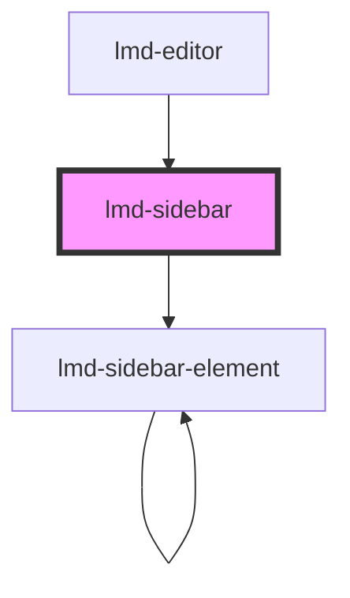

# lmd-sidebar

<!-- Auto Generated Below -->

## Properties

| Property            | Attribute        | Description | Type                  | Default     |
| ------------------- | ---------------- | ----------- | --------------------- | ----------- |
| `data` _(required)_ | --               |             | `NodeObject[]`        | `undefined` |
| `selectedIndex`     | `selected-index` |             | `number \| undefined` | `undefined` |

## Dependencies

### Used by

 - [lmd-editor](../lmd-editor)

### Depends on

- [lmd-sidebar-element](../lmd-sidebar-element)

### Graph

----------------------------------------------

*Built with [StencilJS](https://stenciljs.com/)*
