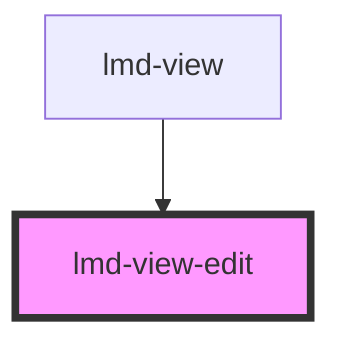

# lmd-view-edit

<!-- Auto Generated Below -->

## Properties

| Property                     | Attribute        | Description | Type                  | Default     |
| ---------------------------- | ---------------- | ----------- | --------------------- | ----------- |
| `data` _(required)_          | --               |             | `NodeObject[]`        | `undefined` |
| `selectedIndex` _(required)_ | `selected-index` |             | `number`              | `undefined` |
| `subElement`                 | `sub-element`    |             | `string \| undefined` | `undefined` |

## Events

| Event    | Description | Type                            |
| -------- | ----------- | ------------------------------- |
| `redraw` |             | `CustomEvent<CustomEvent<any>>` |

## Dependencies

### Used by

 - [lmd-view](../lmd-view)

### Graph

----------------------------------------------

*Built with [StencilJS](https://stenciljs.com/)*
