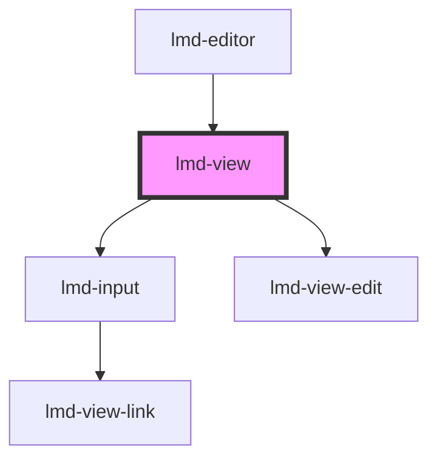

# lmd-view

<!-- Auto Generated Below -->

## Overview

This component represents the properties of a selected entity.

## Properties

| Property            | Attribute        | Description                        | Type                  | Default     |
| ------------------- | ---------------- | ---------------------------------- | --------------------- | ----------- |
| `data` _(required)_ | --               |                                    | `NodeObject[]`        | `undefined` |
| `selectedIndex`     | `selected-index` | The index of the object to render. | `number \| undefined` | `undefined` |

## Events

| Event    | Description | Type                            |
| -------- | ----------- | ------------------------------- |
| `redraw` |             | `CustomEvent<CustomEvent<any>>` |

## Dependencies

### Used by

 - [lmd-editor](../lmd-editor)

### Depends on

- [lmd-input](../lmd-input)
- [lmd-view-edit](../lmd-view-edit)

### Graph

----------------------------------------------

*Built with [StencilJS](https://stenciljs.com/)*
